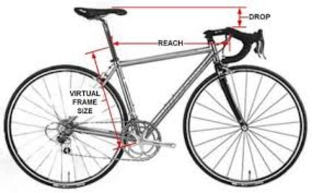
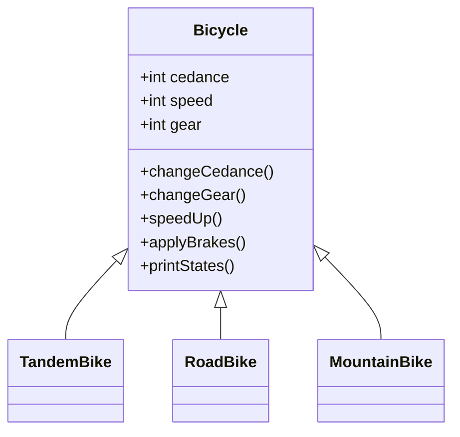
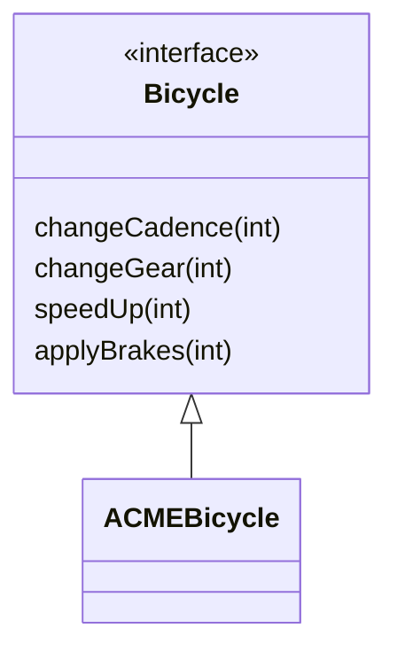

Introduction to basic OOP concepts in Java:
===

<!-- pause -->
Introduction to basic OOP concepts in Java:
 
- Objects
<!-- pause -->
- Classes  
<!-- pause -->
- Inheritance
<!-- pause -->
- Interfaces
<!-- pause -->
- Packages
<!-- pause -->

Each concept relates to the real world while introducing Java syntax.

<!-- end_slide -->

Object
===


A software bundle of related state and behavior.

## Key characteristics:
<!-- pause -->
- State (represented by fields/variables)  
<!-- pause -->
- Behavior (represented by methods/functions)


<!-- pause -->

## Real-world examples:
<!-- pause -->
- Dogs: state (name, color), behavior (barking)
<!-- pause -->
- Bicycles: state (speed, gear), behavior (changing gear)

<!-- end_slide -->

Object
===
<!-- pause -->

## Object Benefits

Key advantages of objects:
<!-- pause -->
1. Modularity: Independent code units
<!-- pause -->
2. Information-hiding: Internal details hidden
<!-- pause -->
3. Code re-use: Existing objects can be reused  
<!-- pause -->
4. Pluggability: Easy to replace objects
<!-- pause -->
5. Debugging ease: Fix/replace individual objects

<!-- end_slide -->

Object
===

<!-- pause -->
## Classes:

<!-- pause -->
A class is the blueprint from which individual objects are created.
<!-- pause -->

Example Bicycle class defines:
<!-- pause -->

- Fields (state): cadence,speed,and gear.
<!-- pause -->

- Methods (behavior): changeCadence, changeGear, speedUp, applyBrakes, and printStates.

<!-- end_slide -->


```java
class Bicycle {

  int gear = 1;
  int speed = 0;

  void changeGear(int newValue) { gear = newValue;}

  void speedUp(int increment) { speed = speed + increment;  }

  void applyBrakes(int decrement) { 
    speed = speed - decrement; }

  void printStates() {
    System.out.println("speed:" + speed 
    + " gear:" + gear);
  }
}
```


<!-- end_slide -->

```java
//Creating and using Bicycle objects:
class BicycleDemo {
  public static void main(String[] args) {

    // Create two different Bicycle objects
    Bicycle bike1 = new Bicycle();
    Bicycle bike2 = new Bicycle();

    // Invoke methods on objects
    bike1.speedUp(10);
    bike1.changeGear(2);
    bike1.printStates();

    bike2.speedUp(10);
    bike2.speedUp(10);
    bike2.printStates();
  }
}
```

<!-- end_slide -->

Inheritance
===


Different kinds of objects often share common characteristics. 
Example: Mountain bikes, road bikes, and tandem bikes all have:
- Current speed 
- Current gear 

<!-- end_slide -->

Inheritance
===

Each type adds unique features:


<!-- column_layout: [1,1 , 1] -->

<!-- column: 0 -->
<!-- pause -->
### Tandem bikes: Two seats & handlebars 


<!-- column: 1 -->
<!-- pause -->
### Road bikes: Drop handlebars 


<!-- column: 2 -->
<!-- pause -->
### Mountain bikes: Additional chain ring 


<!-- reset_layout -->
<!-- end_slide -->

Inheritance
===

## Inheritance allows classes to inherit state and behavior from other classes.

Key concepts:
- **Superclass** (Parent class, e.g., `Bicycle`) 
- **Subclass** (Child class, e.g., `MountainBike`) 
- Java allows single inheritance (one direct superclass) 
- Unlimited subclasses per superclass


<!-- end_slide -->
Inheritance
===


<!-- column_layout: [3, 2] -->

<!-- column: 0 -->
<!-- pause -->
## Class Diagram Hierarchy Example

```java
class TandemBike extends Bicycle {
    // inherits all fields and methods from Bicycle
}
```
<!-- pause -->

<!-- column: 1 -->




<!-- reset_layout -->
<!-- end_slide -->


Interfaces
===

## In its most common form, an interface is a group of related methods with empty bodies.


```java
interface Bicycle {
    // wheel revolutions per minute
    void changeCadence(int newValue);
    void changeGear(int newValue);
    void speedUp(int increment);
    void applyBrakes(int decrement);
}
```
<!-- end_slide -->


<!-- column_layout: [3, 1] -->

<!-- column: 0 -->

## Implementing an Interface

1. Change the class name (e.g., to `ACMEBicycle`)
2. Use the `implements` keyword

```java
class ACMEBicycle implements Bicycle {
    int cadence = 0;
    int speed = 0;
    int gear = 1;
    
    // Interface methods must be implemented
    void changeCadence(int newValue) {
        cadence = newValue;
    }
    // implements all other interface methods ...
    //
}
```

<!-- column: 1 -->
<!-- new_line -->
<!-- pause -->
## Class Diagram


<!-- reset_layout -->
<!-- end_slide -->


Packages
===  

<!-- pause -->

## A **package** is a namespace that organizes related classes and interfaces.  

Think of it like folders on your computer:  
- HTML files in one folder  
- Images in another  
- Scripts in a separate folder  

Java programs can have *hundreds* of classes—packages keep them organized.  

<!-- end_slide -->  

Packages
===

## Java’s Built-in Packages  

The Java platform provides a vast **class library** (set of packages) called the **API** (*Application Programming Interface*).  

These packages handle common tasks, such as:  
- **`String`**: Text manipulation  
- **`File`**: Create, delete, or modify files  
- **`Socket`**: Network communication  
- **GUI components**: Buttons, checkboxes, etc.  

Thousands of prebuilt classes let you focus on your app’s logic.  

<!-- end_slide -->
Packages
===
<!-- pause -->
## The Java API Documentation  

The **Java Platform API Specification** lists all packages, classes, and methods in Java SE.  

<!-- end_slide -->  

# References
https://dev.java/learn/oop/

