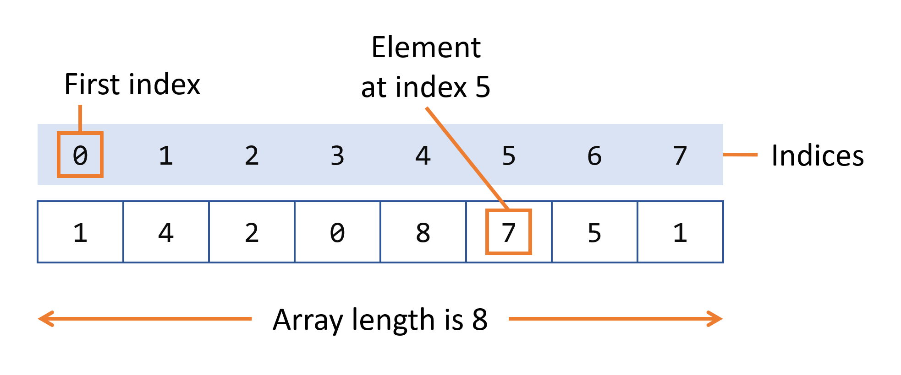

---
theme:
  override:
    code:
        alignment: left
        margin:
            percent: 5
    #   padding:
        # horizontal: 4
---

Arrays
===

<!-- pause -->
An array is a container object that holds a fixed number of values of a single type. The length of an array is established when the array is created. After creation, its length is fixed.


<!-- column_layout: [1, 1] -->
<!-- column: 0 -->  
<!-- pause -->
## Array Illustration



<!-- pause -->
## Array Length Property
```java
System.out.println(anArray.length);  // Prints array size
```
<!-- pause -->
## Key points:
<!-- pause -->
- Arrays have fixed length after creation
<!-- pause -->
- Indexing starts at 0
<!-- pause -->
- Can hold primitive types or objects

<!-- column: 1 -->
<!-- pause -->
## Array Demo Example

```java +exec
class ArrayDemo {
  public static void main(String[] args) {
    int[] anArray = new int[10];

    // Initializing array elements
    anArray[0] = 100;
    anArray[1] = 200;
    // ... up to index 9

    // Accessing elements
    System.out.println("Element at index 0: " + anArray[0]);
    // ... other elements
  }
}
```
<!-- reset_layout -->
<!-- end_slide -->

Declaring Array Variables
===

<!-- column_layout: [1, 1] -->
<!-- column: 0 -->
<!-- pause -->

## Syntax:
```java
type[] arrayName;
```
<!-- pause -->

## Examples:
```java
int[] anArray;
byte[] anArrayOfBytes;
String[] anArrayOfStrings;
```
<!-- pause -->

## Convention discourages this form:
```java
float anArrayOfFloats[];  // Not recommended
```
<!-- pause -->

## Using `new` operator:
```java
anArray = new int[10];  // Array of 10 integers
```

<!-- column: 1 -->
<!-- pause -->
## Shortcut syntax:
```java
int[] anArray = { 
    100, 200, 300,
    400, 500, 600,
    700, 800, 900, 1000 
};
```
<!-- pause -->

## Multidimensional 2D Array

```java
String[][] names = {
    {"Mr. ", "Mrs. ", "Ms. "},
    {"Smith", "Jones"}
};
```
<!-- pause -->

## Accessing elements in 2D array:
```java
System.out.println(names[0][0] + names[1][0]);
    // "Mr. Smith"
System.out.println(names[0][2] + names[1][1]);  
    // "Ms. Jones"
```

<!-- reset_layout -->
