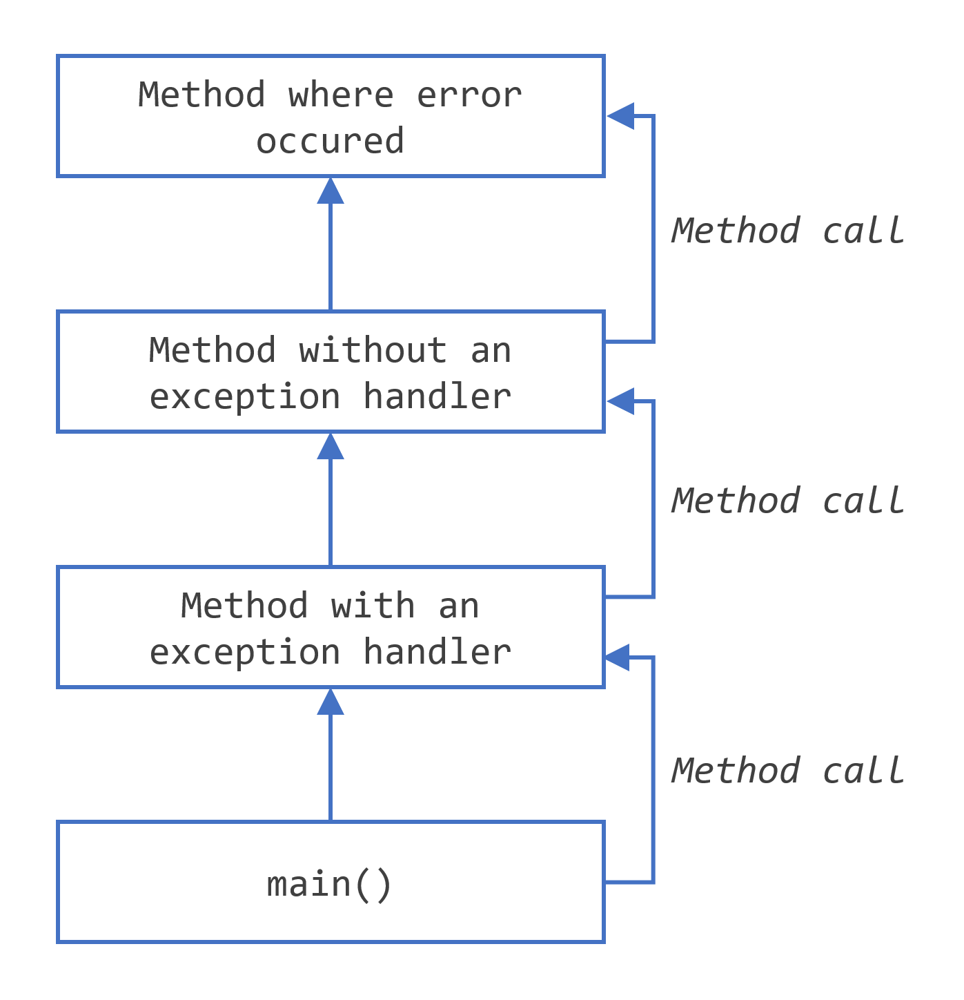
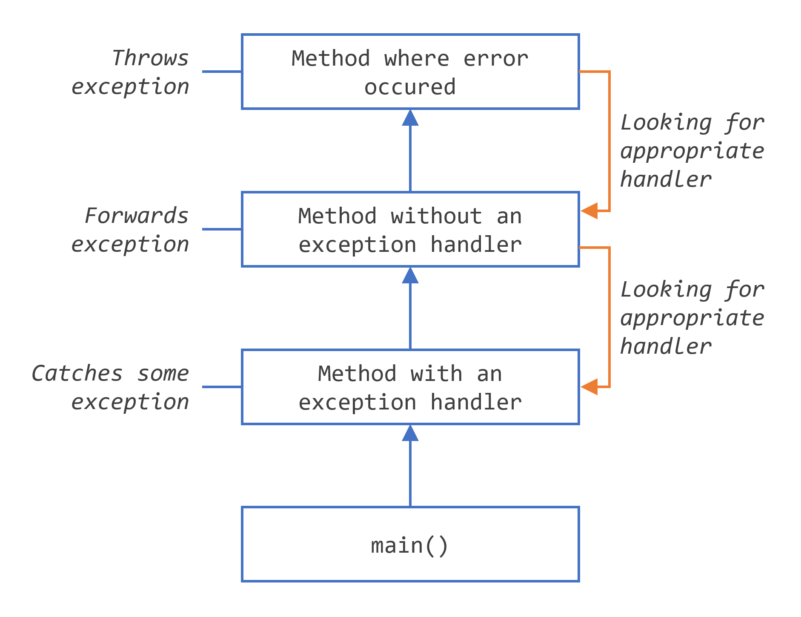
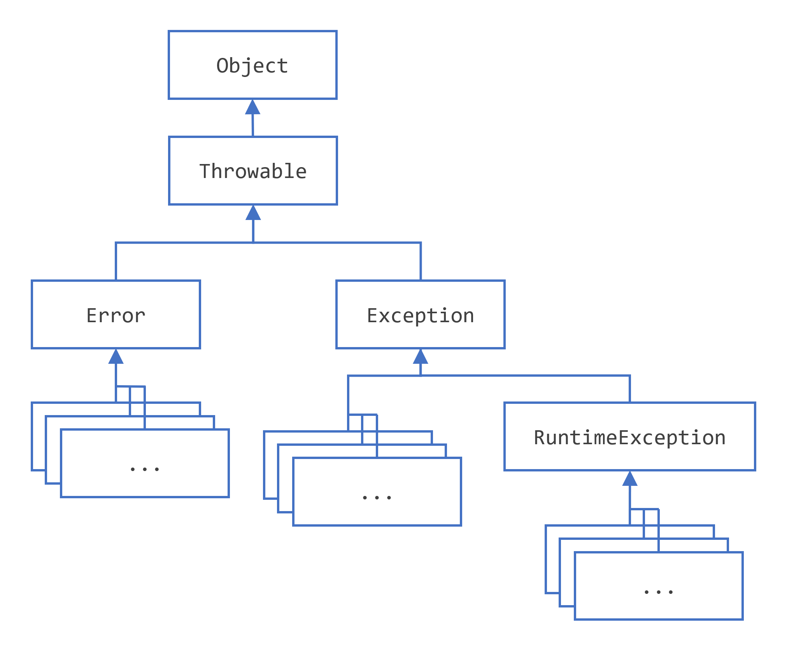

# What Is an Exception?

An **exception** is an event that occurs during program execution that disrupts the normal flow of instructions.

<!-- end_slide -->

## Example of an Exception

```java
int[] numbers = {1, 2, 3};
System.out.println(numbers[5]); // Exception!
````

<!-- pause -->

This causes:

* `ArrayIndexOutOfBoundsException`
* Because index 5 does not exist

<!-- end_slide -->


## What Happens When an Exception Occurs?


<!-- pause -->
<!-- incremental_lists: true -->
- Java creates an **exception object**
- The object contains information about the error
- Exception object is handed off to the runtime system (throwing an exception)
- The program flow is interrupted
- The runtime system searches for a handler in the ordered list of methods that led to the exception (**call stack**)
- If found then exception is handled
- If not found then the program terminates with an error message


<!-- pause -->

This process is called **exception handling**

<!-- end_slide -->


## Exceptions in Java
<!-- column_layout: [1, 1] -->
<!-- column: 0 -->
<!-- pause -->
### Exception call stack



<!-- column: 1 -->
<!-- pause -->
### Exception Handler



<!-- reset_layout -->

<!-- end_slide -->

## Exception Object

An exception object contains:

<!-- incremental_lists: true -->

* Type of error
* Location where it occurred
* Stack trace (call history)

<!-- pause -->

Example:

```java
Exception in thread "main" java.lang.ArrayIndexOutOfBoundsException
```

<!-- end_slide -->

## Exception Hierarchy

All exceptions are part of a class hierarchy.




<!-- end_slide -->

## Errors vs Exceptions

<!-- incremental_lists: true -->

<!-- column_layout: [1, 1] -->

<!-- column: 0 -->
<!-- pause -->
### Errors

<!-- pause -->

* Serious problems
* Not meant to be handled
* Example:

```java
OutOfMemoryError
```

<!-- column: 1 -->
<!-- pause -->
### Exceptions

<!-- pause -->

* Conditions applications may handle
* Recoverable
* Example:

```java
IOException
```

<!-- reset_layout -->

<!-- end_slide -->

## Checked vs Unchecked Exceptions

<!-- incremental_lists: true -->
<!-- pause -->
### Checked Exceptions

<!-- pause -->

* Checked at compile time
* Must be handled or declared

```java
IOException
```

<!-- pause -->

### Unchecked Exceptions

* Occur at runtime
* Not required to handle

```java
NullPointerException
```

<!-- end_slide -->

## Checked Exception Example

```java
FileReader file = new FileReader("file.txt");
```

<!-- pause -->

Compiler error unless handled:

```java
try {
    FileReader file = new FileReader("file.txt");
} catch (IOException e) {
    e.printStackTrace();
}
```

<!-- end_slide -->

## Unchecked Exception Example

```java
String str = null;
System.out.println(str.length()); // NullPointerException
```

<!-- pause -->

* No compile-time error
* Fails at runtime

<!-- end_slide -->


## Why Use Exceptions?

<!-- incremental_lists: true -->

* Separate error-handling code from regular code
* Improve readability
* Handle unexpected situations gracefully
* Prevent program crashes

<!-- end_slide -->

# Catching and Handling Exceptions

Java provides a mechanism to **handle exceptions** so that programs can continue running.

<!-- pause -->

This is done using:
- `try`
- `catch`
- `finally`

<!-- end_slide -->

## The try Block

The `try` block contains code that might throw an exception.

```java
try {
    // code that may throw exception
}
````

<!-- pause -->

* Must be followed by at least one `catch` or a `finally`

<!-- end_slide -->

## The catch Block

A `catch` block handles the exception.

```java
try {
    // risky code
} catch (ExceptionType name) {
    // handler code
}
```

<!-- pause -->

* Runs only if matching exception occurs
* `name` gives access to the exception object

<!-- end_slide -->

## Example: Basic try-catch

```java
try {
    int[] arr = {1, 2, 3};
    System.out.println(arr[5]);
} catch (ArrayIndexOutOfBoundsException e) {
    System.out.println("Invalid index!");
}
```

<!-- pause -->

* Prevents program crash
* Handles the error gracefully

<!-- end_slide -->

## Multiple catch Blocks

You can handle different exceptions separately:

```java
try {
    // code
} catch (IOException e) {
    // handle IO
} catch (SQLException e) {
    // handle DB
}
```

<!-- pause -->

* Only one `catch` block executes
* Order matters (specific → general)

<!-- end_slide -->

## Catch Order Matters

```java
catch (Exception e) { }   // general
catch (IOException e) { } // ❌ unreachable
```

<!-- pause -->

Correct order:

```java
catch (IOException e) { }
catch (Exception e) { }
```

<!-- end_slide -->

## Multi-Catch (Java 7+)

Handle multiple exceptions in one block:

```java
try {
    // code
} catch (IOException | SQLException e) {
    System.out.println("Exception occurred");
}
```

<!-- pause -->

* Reduces duplication
* Exception variable is implicitly final

<!-- end_slide -->

## The finally Block

The `finally` block always executes:

```java
try {
    // code
} catch (Exception e) {
    // handler
} finally {
    // always runs
}
```

<!-- pause -->

* Executes whether exception occurs or not
* Commonly used for cleanup

<!-- end_slide -->

## Example: finally Usage

```java
FileReader file = null;
try {
    file = new FileReader("file.txt");
} catch (IOException e) {
    e.printStackTrace();
} finally {
    // Try to close the file!
    if (file != null) {
        file.close(); // can you see the problem here?
    }
}
```

<!-- pause -->

Ensures resource is closed

<!-- end_slide -->

## try-with-resources (Java 7+)

Automatically closes resources:

```java
try (FileReader file = new FileReader("file.txt")) {
    // use file
}
```

<!-- pause -->

* No need for `finally`
* Resource must implement `AutoCloseable`

<!-- end_slide -->

## try-with-resources Example

```java
try (BufferedReader br = 
        new BufferedReader(new FileReader("file.txt"))) {
    System.out.println(br.readLine());
} catch (IOException e) {
    e.printStackTrace();
}
```

<!-- pause -->

Cleaner and safer resource management

<!-- end_slide -->

## Accessing Exception Information

Exception object provides useful methods:

```java
catch (Exception e) {
    System.out.println(e.getMessage());
    e.printStackTrace();
}
```

<!-- pause -->

Common methods:

* `getMessage()`
* `printStackTrace()`

<!-- end_slide -->

## Stack Trace

Stack trace shows:

* Method call history
* Where the exception occurred

<!-- pause -->

Example:

```java
java.lang.NullPointerException
    at Main.main(Main.java:5)
```


<!-- end_slide -->

# Throwing Exceptions

In Java, you can explicitly throw exceptions using the `throw` statement.

<!-- pause -->

This allows you to:
- Signal that an error has occurred  
- Enforce rules in your program  

<!-- end_slide -->

## The throw Statement

Syntax:

```java
throw exceptionObject;
````

<!-- pause -->

* Used inside methods or blocks
* Must throw an object of type `Throwable`

<!-- end_slide -->

## Example: Throwing an Exception

```java
if (age < 18) {
    throw new IllegalArgumentException("Age must be at least 18");
}
```

<!-- pause -->

* Creates and throws exception immediately
* Stops normal program flow

<!-- end_slide -->

## What Happens After throw?

<!-- incremental_lists: true -->

* Execution stops at the `throw` statement
* Control is transferred to nearest handler
* If no handler → program terminates

<!-- end_slide -->

## Throwing Checked Exceptions

Checked exceptions must be declared using `throws`.

```java
public void readFile(String fileName) throws IOException {
    if (!Files.exists(Path.of("file"))) {
        throw new IOException("File not found");
    }
}
```

<!-- pause -->

* Compiler enforces handling
* Must be caught or declared

<!-- end_slide -->

## The throws Clause

Used in method declarations:

```java
public void methodName() throws ExceptionType {
    // code
}
```

<!-- pause -->

* Declares possible exceptions
* Passes responsibility to caller

<!-- end_slide -->

## Example: Using throws

```java
public void process() throws IOException {
    FileReader file = new FileReader("file.txt");
}
```

<!-- pause -->

Caller must handle it:

```java
try {
    process();
} catch (IOException e) {
    e.printStackTrace();
}
```

<!-- end_slide -->

## throw vs throws

<!-- column_layout: [1, 1] -->

<!-- incremental_lists: true -->
<!-- column: 0 -->
<!-- pause -->
### throw

<!-- pause -->

* Used inside method
* Throws one exception
* Followed by object

```java
throw new Exception();
```

<!-- column: 1 -->

<!-- pause -->
### throws


* Used in method signature
* Declares exceptions
* Can list multiple

```java
void m() throws IOException
```

<!-- reset_layout -->

<!-- end_slide -->

## Throwing Unchecked Exceptions

Unchecked exceptions do NOT require declaration:

```java
throw new NullPointerException("Null value!");
```

<!-- pause -->

* Not checked at compile time
* Often used for programming errors

<!-- end_slide -->

## When to Throw Exceptions

<!-- incremental_lists: true -->

* Invalid method arguments
* Violation of business rules
* Unexpected program state
* Input validation failures

<!-- end_slide -->

## Creating Custom Exceptions

You can define your own exception classes:

```java
class InvalidAgeException extends Exception {
    public InvalidAgeException(String message) {
        super(message);
    }
}
```

<!-- pause -->

Throw it like:

```java
throw new InvalidAgeException("Invalid age");
```

<!-- end_slide -->

## Checked vs Unchecked Custom Exceptions

<!-- incremental_lists: true -->


<!-- pause -->
### Checked


* Extend `Exception`
* Must be declared

<!-- pause -->
### Unchecked


* Extend `RuntimeException`
* No declaration required


<!-- end_slide -->

## Example: Custom Exception Usage

```java
public void register(int age) throws InvalidAgeException {
    if (age < 18) {
        throw new InvalidAgeException("Must be 18+");
    }
}
```

<!-- pause -->

Ensures rule enforcement

<!-- end_slide -->

## Best Practices

<!-- incremental_lists: true -->

* Throw specific exceptions
* Include meaningful messages
* Avoid overusing checked exceptions
* Use custom exceptions when needed
* Do not use exceptions for normal flow

<!-- end_slide -->


# Unchecked Exception Controversy

Java distinguishes between:
- Checked exceptions  
- Unchecked exceptions  

<!-- pause -->

The debate centers on:

<!-- incremental_lists: true -->
- Should exceptions be enforced at compile time?  
- Or handled only at runtime?  


<!-- end_slide -->


## Advantages of Checked Exceptions

<!-- incremental_lists: true -->

* Forces developers to handle errors
* Makes APIs explicit about failures
* Improves reliability

<!-- pause -->

Encourages careful programming


## Disadvantages of Checked Exceptions

<!-- incremental_lists: true -->

* Leads to verbose code
* Can clutter method signatures
* Often handled poorly (empty catch blocks)

<!-- pause -->

Developers may ignore or misuse them

<!-- end_slide -->

## Advantages of Unchecked Exceptions

<!-- incremental_lists: true -->

* Cleaner, less verbose code
* No need to declare in methods
* Better for programming errors

<!-- pause -->

More flexible design

<!-- end_slide -->

## Disadvantages of Unchecked Exceptions

<!-- incremental_lists: true -->

* Errors may go unnoticed
* No compile-time enforcement
* Can lead to runtime failures

<!-- pause -->

Requires discipline from developers

<!-- end_slide -->

## Design Philosophy

<!-- pause -->
<!-- incremental_lists: true -->
<!-- column_layout: [1, 1] -->

<!-- column: 0 -->

### Checked Approach

<!-- pause -->

* Safer
* Explicit
* Compiler-enforced

<!-- column: 1 -->

<!-- pause -->
### Unchecked Approach


* Simpler
* Flexible
* Developer responsibility

<!-- reset_layout -->

<!-- end_slide -->

## When to Use Checked Exceptions

<!-- incremental_lists: true -->

* Recoverable conditions
* External system failures (I/O, network)
* Situations caller can handle

<!-- pause -->

## When to Use Unchecked Exceptions


* Programming errors
* Invalid arguments
* Bugs (null references, logic errors)

<!-- end_slide -->

## references:

- [](https://dev.java/learn/exceptions/)
