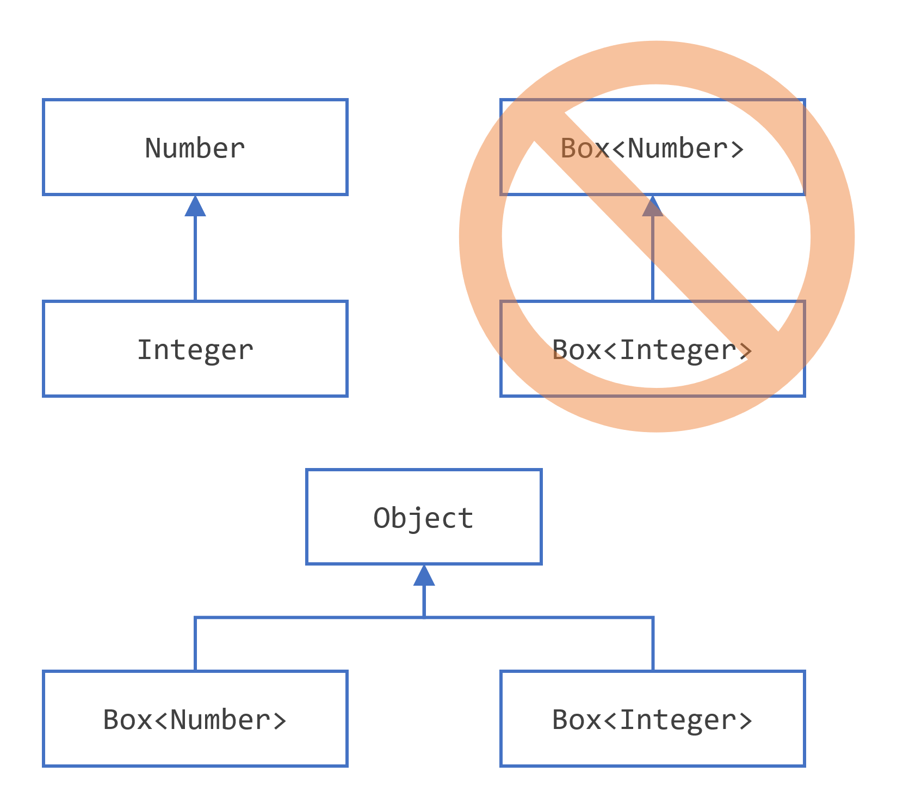
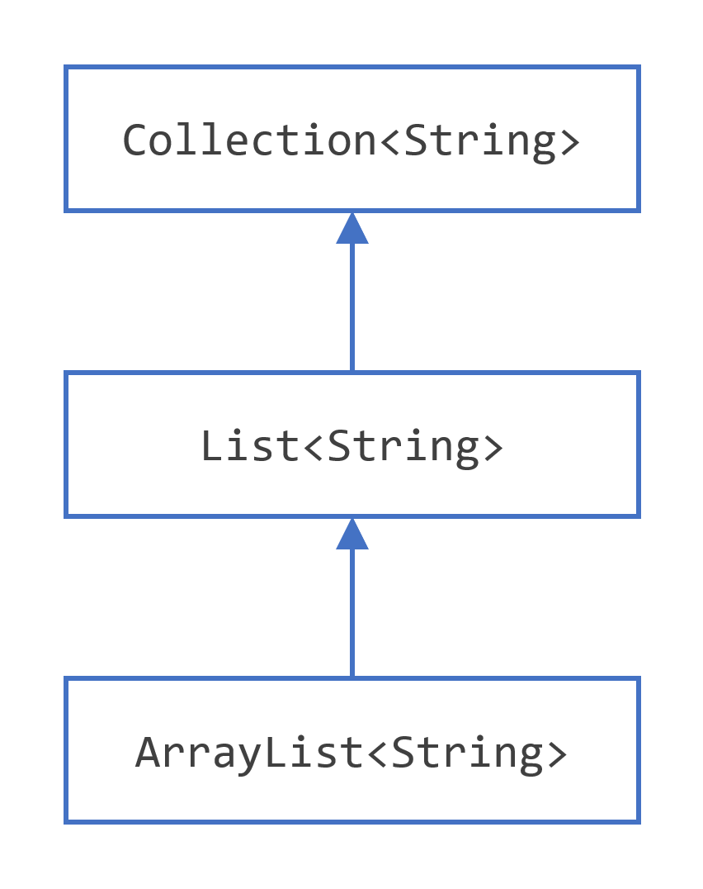

Generics
===
<!-- incremental_lists: true -->
- Why Use Generics?
- Generic Types
- Raw Types
- Generic Methods
- Bounded Type Parameters
- Generic Methods and Bounded Type Parameters
- Generics, Inheritance, and Subtypes

<!-- end_slide -->

Why Use Generics
===

## Why Use Generics?
In a nutshell, generics enable types (classes and interfaces) to be parameters when defining classes, interfaces and methods.

Benefits:
- Stronger type checks at compile time
- Elimination of casts
- Enables implementation of generic algorithms

<!-- end_slide -->


Generic Types
===

<!-- pause -->
## Without generics (requires casting)
```java
List list = new ArrayList();
list.add("hello");
String s = (String) list.get(0);
```
<!-- pause -->
## With generics (no casting needed)

```java
List<String> list = new ArrayList<String>();
list.add("hello");
String s = list.get(0);
```
<!-- end_slide -->

Generic Types
===

## Generic Types: A Simple Box Class
```java
public class Box {
    private Object object;

    public void set(Object object) { this.object = object; }
    public Object get() { return object; }
}
```
<!-- pause -->
**Problem**: No type safety at compile time

<!-- end_slide -->

Generic Types
===

## A Generic Version of the Box Class
```java
public class Box<T> {
    private T t;

    public void set(T t) { this.t = t; }
    public T get() { return t; }
}
```
<!-- incremental_lists: true -->
- `T` is a type parameter
- Can be any non-primitive type
<!-- end_slide -->

Generic Types
===

## Type Parameter Naming Conventions
<!-- incremental_lists: true -->

Common single-letter uppercase names:
- E - Element
- K - Key
- N - Number
- T - Type
- V - Value
- S, U, V - 2nd, 3rd, 4th types

<!-- end_slide -->

Generic Types
===

## Instantiating Generic Types
```java
Box<Integer> integerBox = new Box<Integer>();
// Java 7+ diamond syntax:
Box<Integer> integerBox = new Box<>();
```
- `Integer` is the type argument
- `Box<Integer>` is a parameterized type

<!-- end_slide -->

Generic Types
===

## Multiple Type Parameters
```java
public interface Pair<K, V> {
    public K getKey();
    public V getValue();
}

public class OrderedPair<K, V> implements Pair<K, V> {
    private K key;
    private V value;
    
    // constructor and methods
}
```
<!-- end_slide -->

Generic Types
===
<!-- pause -->
## Using Multiple Type Parameters
```java
Pair<String, Integer> p1 = new OrderedPair<>("Even", 8);
Pair<String, String> p2 = new OrderedPair<>("hello", "world");
```

<!-- pause -->
## Parameterized Types as Type Arguments
```java
OrderedPair<String, Box<Integer>> p = 
  new OrderedPair<>("primes", new Box<Integer>());
```
<!-- pause -->
Can use parameterized types (like `Box<Integer>`) as type arguments

<!-- end_slide -->


Raw Types
===

## What are Raw Types?
A raw type is a generic class/interface used without type arguments.

```java
public class Box<T> {
    public void set(T t) { /* ... */ }
    // ...
}

// Parameterized type
Box<Integer> intBox = new Box<>();

// Raw type
Box rawBox = new Box();
```
<!-- end_slide -->


Raw Types
===

## Raw Types in Legacy Code
<!-- incremental_lists: true -->
- Appear in pre-JDK 5.0 code
- Collections classes were non-generic originally
- Provide pre-generics behavior (returns Objects)
- Allowed for backward compatibility

```java
Box<String> stringBox = new Box<>();
Box rawBox = stringBox;  // OK (backward compatibility)
```
<!-- end_slide -->


Raw Types
===

## Raw Type Warnings
Converting between raw and parameterized types generates warnings:

```java
Box rawBox = new Box();
Box<Integer> intBox = rawBox;  // warning: unchecked conversion

rawBox.set(8);  // warning: unchecked invocation to set(T)
```
<!-- incremental_lists: true -->
- Bypasses generic type checks
- Errors caught at runtime instead of compile-time
<!-- end_slide -->


Raw Types
===

## Unchecked Error Messages
Common warning when mixing legacy and generic code:

```
Note: Example.java uses unchecked or unsafe operations.
Note: Recompile with -Xlint:unchecked for details.
```

<!-- end_slide -->

Raw Types
===

## Unchecked Error Messages

Example:
```java
public class WarningDemo {
    public static void main(String[] args){
        Box<Integer> bi = createBox();  // warning
    }

    static Box createBox() {  // raw type
        return new Box();
    }
}
```
<!-- end_slide -->


Raw Types
===

<!-- pause -->
## Managing Unchecked Warnings
<!-- pause -->
### Compiler options:
  - `-Xlint:unchecked` - show all unchecked warnings
  - `-Xlint:-unchecked` - disable unchecked warnings

<!-- pause -->
###  Using annotations:
```java
@SuppressWarnings("unchecked")
void myMethod() {
    // code with unchecked operations
}
```
<!-- pause -->
**Best practice**: Avoid raw types when possible
<!-- end_slide -->


Generic Example
===

## Example: Pair Class
```java
public class Pair<K, V> {
    private K key;
    private V value;
    
    public Pair(K key, V value) {
        this.key = key;
        this.value = value;
    }
    
    // getters and setters
}
```
<!-- end_slide -->

Generic Methods
===

## Introduction to Generic Methods
Methods that introduce their own type parameters:
- Can be static or non-static
- Can include generic constructors
- Type parameter scope limited to the method

```java
public class Util {
    public static <K, V> boolean compare(Pair<K, V> p1, Pair<K, V> p2) {
        return p1.getKey().equals(p2.getKey()) &&
               p1.getValue().equals(p2.getValue());
    }
}
```
<!-- end_slide -->

Generic Methods
===

## Generic Method Syntax
- Type parameters declared before return type
- For static methods: must appear before return type
- Can use multiple type parameters

```java
public <T> void myMethod(T item) {
    // method implementation
}
```
<!-- end_slide -->

Generic Methods
===

## Invoking Generic Methods
### Explicit Type Specification
```java
Pair<Integer, String> p1 = new Pair<>(1, "apple");
Pair<Integer, String> p2 = new Pair<>(2, "pear");
boolean same = Util.<Integer, String>compare(p1, p2);
```
<!-- end_slide -->

Generic Methods
===

## Invoking Generic Methods
### Type Inference
Compiler can infer types automatically:

```java
Pair<Integer, String> p1 = new Pair<>(1, "apple");
Pair<Integer, String> p2 = new Pair<>(2, "pear");
boolean same = Util.compare(p1, p2);  // types inferred
```
- Makes code cleaner
- Works with most generic method calls
<!-- end_slide -->

Generic Methods
===
## Key Points
<!-- incremental_lists: true -->
1. Generic methods introduce their own type parameters
2. Syntax: `<K, V>` before return type
3. Can be used with static methods
4. Type inference eliminates need for explicit types
5. Works well with generic classes like `Pair<K,V>`

<!-- end_slide -->

Bounded Type Parameters
===

## Introduction to Bounded Types
Restrict types that can be used as type arguments:
- Uses `extends` keyword (for both classes and interfaces)
- Provides compile-time type safety
- Enables access to bound type's methods


<!-- end_slide -->
Bounded Type Parameters: Example
===

<!-- column_layout: [3,7] -->
<!-- column: 0 -->
```java
public class Box<T> {

  private T t;          

  public void set(T t) {
    this.t = t;
  }

  public T get() {
    return t;
  }
  ..
```
<!-- column: 1 -->
```java
..
public <U extends Number> void inspect(U u){
  System.out.println("T: " + t.getClass().getName());
  System.out.println("U: " + u.getClass().getName());
}
public static void main(String[] args) {
  Box<Integer> integerBox = new Box<Integer>();
  integerBox.set(10); //auto boxing
  
  // error: this is still String!
  integerBox.inspect("some text"); 
}
```
<!-- reset_layout -->
<!-- end_slide -->

Bounded Type Parameters
===

## Example: Bounded Type Parameter
```java
Box<Integer> integerBox = new Box<>();
integerBox.set(10);
integerBox.inspect("some text"); // Compile-time error!
```
Error message:
```
<U>inspect(U) in Box<java.lang.Integer> cannot
be applied to (java.lang.String)
```
<!-- end_slide -->
Bounded Type Parameters
===

## Accessing Bound Type Methods
Bounded types allow method invocation from the bound:

```java
public class NaturalNumber<T extends Integer> {
    private T n;
    
    public boolean isEven() {
        return n.intValue() % 2 == 0; // Can call Integer methods
    }
}
```
<!-- end_slide -->

Bounded Type Parameters
===

## Multiple Bounds
Type parameters can have multiple bounds:
- Syntax: `<T extends B1 & B2 & B3>`
- If including a class, it must be first

```java
class A { /* ... */ }
interface B { /* ... */ }
interface C { /* ... */ }

class D <T extends A & B & C> { /* ... */ } // Correct

class D <T extends B & A & C> { /* ... */ } // Compile-time error
```
<!-- end_slide -->
Bounded Type Parameters
===

## Key Points

<!-- incremental_lists: true -->
1. Restrict type arguments using `extends`
2. Can use both classes and interfaces as bounds
3. Enables access to bound type's methods
4. Supports multiple bounds (class first)
5. Provides compile-time type checking
<!-- end_slide -->

Generic Methods and Bounded Type Parameters
===

## The Problem: Comparing Generic Objects
```java
public static <T> int countGreaterThan(T[] anArray, T elem) {
    int count = 0;
    for (T e : anArray)
        if (e > elem)  // compiler error!
            ++count;
    return count;
}
```
- `>` operator only works with primitives
- Doesn't work with objects
- Need a better way to compare generic objects

<!-- end_slide -->

Generic Methods and Bounded Type Parameters
===

## The Solution: Bounded Type Parameters
Use `Comparable<T>` interface to enable comparison:

```java
public interface Comparable<T> {
    public int compareTo(T o);
}
```
<!-- end_slide -->

Generic Methods and Bounded Type Parameters
===

## The Solution: Bounded Type Parameters

Revised solution:
```java
public static <T extends Comparable<T>> int countGreaterThan(T[] anArray, T elem) {
    int count = 0;
    for (T e : anArray)
        if (e.compareTo(elem) > 0)
            ++count;
    return count;
}
```
<!-- end_slide -->


Generic Methods and Bounded Type Parameters
===
## Example Usage
```java
Integer[] numbers = {1, 5, 3, 8, 2};
int count = countGreaterThan(numbers, 4);  // returns 2

String[] words = {"apple", "banana", "orange"};
int wordCount = countGreaterThan(words, "cherry");
```
<!-- incremental_lists: true -->

- Works with any type implementing `Comparable`
- Type-safe at compile time
- Enables generic algorithms

<!-- end_slide -->

Generic Methods and Bounded Type Parameters
===

## Why This Matters
<!-- incremental_lists: true -->
1. Enables writing generic algorithms
2. Provides compile-time type checking
3. Reusable across different types
4. Safer than using raw types
5. Foundation for Java Collections framework

<!-- end_slide -->


Generics, Inheritance, and Subtypes
===

## Subtyping with Regular Classes
```java
Object someObject = new Object();
Integer someInteger = 10;
someObject = someInteger;  // OK - Integer "is a" Object

public void someMethod(Number n) { /* ... */ }
someMethod(10);  // OK
someMethod(10.1); // OK
```
- Works through normal inheritance hierarchy
- Compatible types can be assigned

<!-- end_slide -->

Generics, Inheritance, and Subtypes
===

## Subtyping with Generics - The Surprise
```java

Box<Number> box = new Box<Number>();
box.add(10);  // OK
box.add(10.1); // OK

public void boxTest(Box<Number> n) { /* ... */ }
boxTest(new Box<Integer>());  // Compile error!
```
- Even though `Integer` is a `Number`
- `Box<Integer>` is NOT a subtype of `Box<Number>`

<!-- end_slide -->
Generics, Inheritance, and Subtypes
===

## Key Concept: Invariance of Generics
<!-- column_layout: [1, 1] -->
<!-- column: 0 -->



<!-- column: 1 -->



<!-- reset_layout -->
<!-- end_slide -->


Generics, Inheritance, and Subtypes
===

## Key Concept: Invariance of Generics
- Given types A and B:
  - `MyClass<A>` has no relationship to `MyClass<B>`
  - Even if A is a subtype of B
- Common parent is always `Object`

```java
Box<Integer> intBox = new Box<>();
Box<Number> numBox = intBox;  // Compile error!
```
<!-- end_slide -->


Generics, Inheritance, and Subtypes
===

## Preserving Subtyping Relationships
When type arguments remain the same:

```java
ArrayList<String> is a subtype of List<String>
List<String> is a subtype of Collection<String>
```
- Subtyping preserved through inheritance hierarchy
- As long as type parameter doesn't change

<!-- end_slide -->

Generics, Inheritance, and Subtypes
===

## Summary of Rules
<!-- incremental_lists: true -->
1. Regular inheritance works normally
2. `Generic<Subtype>` ≠ `Generic<Supertype>`
3. Subtyping preserved when type arguments match
4. Can create complex generic hierarchies
5. Wildcards provide more flexibility (next topic)

<!-- end_slide -->

<!-- new_line -->
**References:**
- https://dev.java/learn/generics/